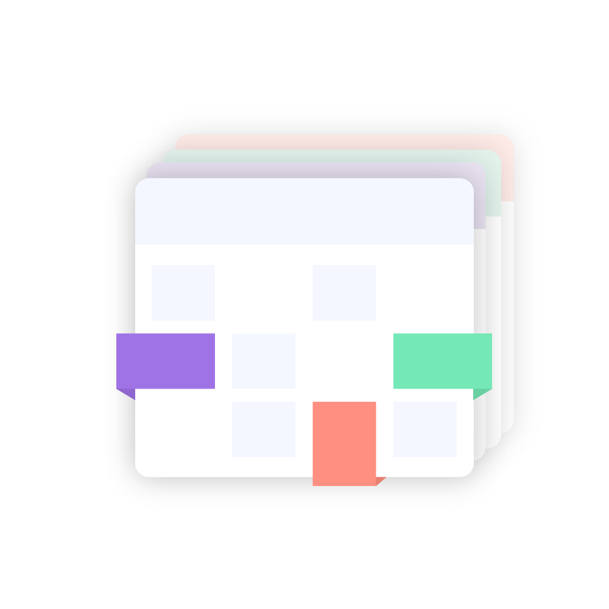

<div align="center">
    <p>
        
        <h1 align="center">CalendarSync</h1>
        <b>Stateless CLI tool to sync calendars across different calendaring systems.</b>
    </p>
</div>

# Motivation

As consultants, you may need to use multiple calendars (2-n). Additionally, you
need to keep up with all existing appointments in each of your calendars when
you want to make new appointments. This means you have to check each calendar on
its own. What we wanted to achieve is a single overview over all events in each
of the calendars. Preferably in your primary calendar.

There are some commercial / freemium solutions for this
([reclaim.ai](https://reclaim.ai/),
[SyncThemCalendars](https://syncthemcalendars.com/)), but their privacy policy
is unclear. Calendar data is not only highly interesting personal data (who
participates in which appointment and when?) but also highly interesting from an
industrial espionage/targeted advertising perspective. The two third party
providers get to see the content of the calendar events. In good appointments,
there is a lot of secret and relevant company data in the appointment agenda.

To keep track of all the events, we created `CalendarSync`, which allows the
syncing of events without breaking data protection laws and without exposing
data to a third party.

# How to use

## Installation

Download the newest [release](https://github.com/inovex/CalendarSync/releases) for your platform or install from [the AUR](https://aur.archlinux.org/packages/calendarsync-bin).

**Using [asdf-vm](https://github.com/asdf-vm/asdf)**

You can also install this program using `asdf-vm`.

```sh
asdf plugin add calendarsync
# or
asdf plugin add calendarsync https://github.com/FeryET/asdf-calendarsync.git
## finally
asdf install calendarsync
```
Note: The `asdf` plugin is not managed by inovex, but is provided by a CalendarSync user. inovex assumes no responsibility for proper provisioning.

## First Time Execution

Create a modified `sync.yaml` file based on the content of the `./example.sync.yaml` file. Finally, start the app using `CALENDARSYNC_ENCRYPTION_KEY=<YourSecretPassword> ./calendarsync --config sync.yaml` and follow the instructions in the output.

The app will create a file in the execution folder called `auth-storage.yaml`. In this file the OAuth2 Credentials will be saved encrypted by your `$CALENDARSYNC_ENCRYPTION_KEY`.

----

# Configuration

The CalendarSync config file consists of several building blocks:

- `sync` - Controls the timeframe to be synced
- `source` - Controls the source calendar to be synced from
- `sink`- Controls the sink (target) calendar where the events from the source
  calendar are written to
- `transformations` - Controls the transformers applied to the events before
  syncing
- `filters` - Controls filters, which allow events to be excluded from syncing
- `auth` - Controls settings regarding the encrypted auth storage file

## Sync

Should be self-explanatory. Configures the timeframe where to sync events. The
currently only implemented identifiers are `MonthStart` and `MonthEnd`.

```yaml
sync:
  start:
    identifier: MonthStart # 1st of the current month
    offset: -1 # MonthStart -1 month (beginning of last month)
  end:
    identifier: MonthEnd # last day of the current month
    offset: +1 # MonthEnd +1 month (end of next month)
```

## Source

Example:

```yaml
source:
  adapter:
    type: "outlook_http"
    calendar: "[base64-formatstring here]"
    oAuth:
      clientId: "[UUID-format string here]"
      tenantId: "[UUID-format string here]"
```

Configures the Source Adapter, for the adapter configuration, check the
documentation [here](./docs/adapters.md).

### Available Source Adapters

- Google
- Outlook
- [ZEP](https://www.zep.de/en/)

## Sink

Example:

```yaml
sink:
  adapter:
    type: google
    calendar: "target-calendar@group.calendar.google.com"
    oAuth:
      clientId: "[google-oAuth-client-id]"
      clientKey: "[google-oAuth-client-key]"
```

Configures the Sink Adapter, for the adapter configuration, check the
documentation [here](./docs/adapters.md).

### Available Sink Adapters

- Google
- Outlook

## Transformers

Basically, only the time is synced. By means of transformers one can sync
individual further data. Some transformers allow for further configuration using
an additional `config` block, such as the `ReplaceTitle` transformer. Below is a
list of all transformers available:

```yaml
transformations:
  - name: KeepDescription
  - name: KeepLocation
  - name: KeepReminders
  - name: KeepTitle
  - name: PrefixTitle
    config:
      Prefix: "[Sync] "
  - name: ReplaceTitle
    config:
      NewTitle: "[synchronized appointment]"
  # Do not use KeepAttendees when the Outlook Adapter is used as a sink. There is no way to suppress mail invitations
  - name: KeepAttendees
    config:
      UseEmailAsDisplayName: true
```

The transformers are applied in a specific order. The order is defined here:
[`internal/sync/transformer.go`](./internal/sync/transformer.go)

## Filters

In some cases events should not be synced. For example, declined events might
create too much noise in the target calendar. These can be filtered by enabling
the corresponding filter.

```yaml
# Filters remove events from being synced due to different criteria
filters:
  # Events where you declined the invitation aren't synced
  - name: DeclinedEvents
  # Events which cover the full day aren't synced
  - name: AllDayEvents
  # Events within the specified timeframe will be retained, while all others will be filtered out.
  # hours are represented in the 24h time format
  - name: TimeFrame
    config:
      HourStart: 8
      HourEnd: 17
  # Events where the title matches the ExcludeRegexp (RE2 Regex) aren't synced
  - name: RegexTitle
    config:
      ExcludeRegexp: ".*test"
```

## Auth

In this section you can configure settings regarding the encrypted local auth storage

```yaml
auth:
  storage_mode: yaml # Currently, only yaml is supported
  config:
    # Here you can use the standard unix abbreviation for home directory (~).
    # This works also for Windows systems e.g. ~\calendar-sync\auth-storage.yaml
    path: "./auth-storage.yaml"
```

# Cleaning Up

You just synced a lot of events in your calendar and decide you want to use a
separate calendar for this? Or you want to remove all the synced events
from your calendar?

Use the `--clean` flag to get rid of all the unwanted events. (We leave your
events which weren't synced with CalendarSync alone! :) )

# Trademarks

GOOGLE is a trademark of GOOGLE INC. OUTLOOK is a trademark of Microsoft
Corporation

# Relevant RFCs and Links

[RFC 5545](https://datatracker.ietf.org/doc/html/rfc5545)  Internet Calendaring
and Scheduling Core Object Specification (iCalendar) is used in the Google
calendar API to denote recurrence patterns. CalDav [RFC
4791](https://datatracker.ietf.org/doc/html/rfc4791) uses the dateformat
specified in RFC 5545.

# License

MIT
