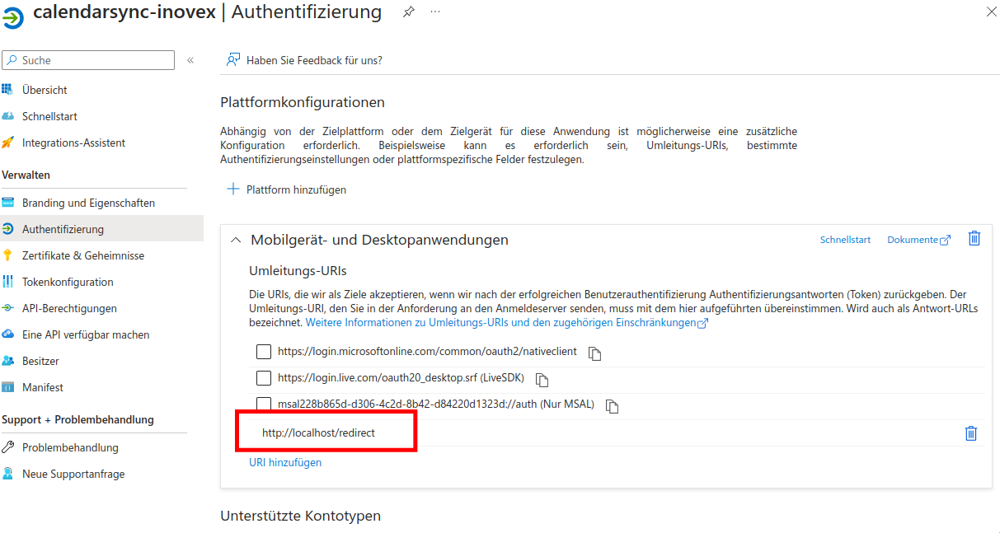
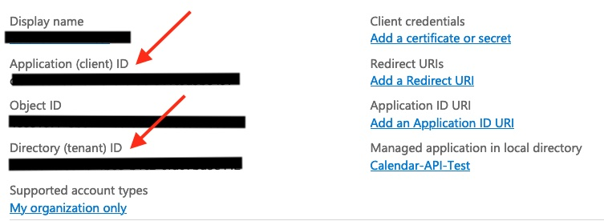
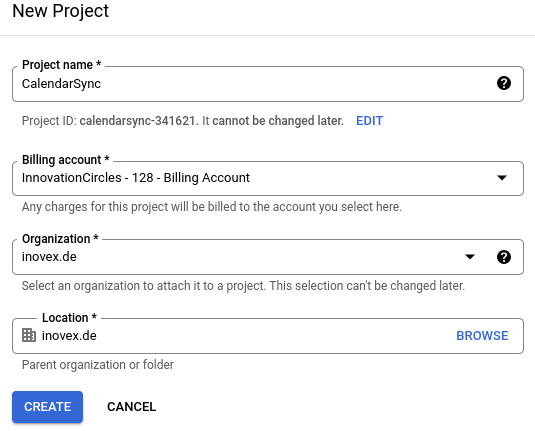
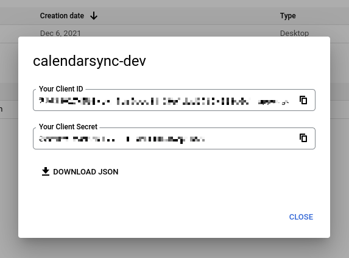
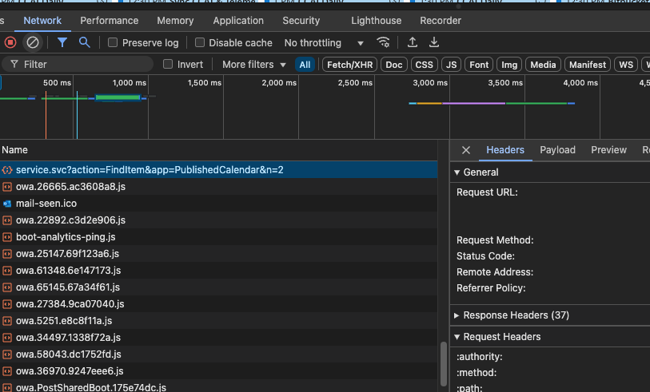

# Adapter Setup

## ZEP Adapter Setup

The ZEP Adapter just the Username and Password as well as the ZEP Endpoint as configuration parameters:

```yaml
source:
  adapter:
    type: "zep"
    calendar: "absences"
    config:
      username: testymctestface@inovex.de
      password: superSuperSecret1337
      endpoint: "https://zep.company.com/zep/sync/dav.php/calendars"
```

The ZEP adapter is only supported as a source.

## Outlook Adapter Setup
The Outlook calendar is synchronized via Microsoft Graph API. You will need to
[register an application on Azure](https://docs.microsoft.com/en-us/azure/active-directory/develop/quickstart-register-app).
The application needs the following permissions:

* `Calendar.ReadWrite`

The `User.read` permission should be assigned by default. To assign the `Calendar.ReadWrite` permission, click on "API Permissions" and add the permission to the "Microsoft Graph API".

You also need to setup a platform specific configuration. This can be done in the "Authentication" menu. Add a "mobile and desktop application" platform configuration and add `http://localhost/redirect` as a valid redirect uri.



The Outlook adapter can be configured as a source using the tenant-id and client-id of the registered Azure app. Both
tenant-id and client-id can be found in the Azure portal "Overview" tab of the previously registered Azure app. If you want to use the adapter to access personal Microsoft accounts, you need to use the tenant `common`.



```yaml
source:
  adapter:
    type: "outlook_http"
    calendar: "[base64-format string here]"
    config:
      tenantId: "[UUID-format string here]"
      clientId: "[UUID-format string here]"
```

To get your calendar ID, use the [Microsoft Graph Explorer](https://developer.microsoft.com/en-us/graph/graph-explorer) and query `GET https://graph.microsoft.com/v1.0/me/calendar`.


## Google Adapter Setup

+ Open the [Google Cloud Console](https://console.cloud.google.com/home/dashboard) and login.
+ Now you can either select *New Project* at the top left of the screen or just [click here](https://console.cloud.google.com/projectcreate)
+ Create a new project, name it as you like but make sure that the Billing Account is set correctly.



+ Now you should be able to select the project in the top left corner. Most likely the project will already be selected now.
+ Either follow the [enable calendar API](https://console.cloud.google.com/flows/enableapi?apiid=calendar-json.googleapis.com) link or follow the steps below.
    + In the search bar, look for `google calendar` and select the **Google Calendar API**
    + You'll be redirected to the API description. Hit the *Enable* button.
+ Once the API is enabled, you'll be redirected again to the API management overview.
+ Click on *Credentials* in the sidebar and then on *Create Credentials*
+ We will need to create an *OAuth client ID*
    + Select *Desktop app* as application type and give it a name of your liking (*calendarsync-dev* maybe?)
+ Once The client ID is created you will see it in the overview.
+ Click on the download icon of the created client
    + You'll see a popup open. Here you can simply **Download JSON**. This will download the `credentials.json` file required.



```yaml
sink:
  adapter:
    type: google
    calendar: "jerrymccoopface@example.com"
    oAuth:
      clientId: "<clientID>"
      clientKey: "<clientSecret>"
```

Important: When retrieving the credentials from Google, you'll get a `clientId`
and a `clientSecret`. Make sure to add the `clientSecret` to the `clientKey`
setting in your CalendarSync configuration.

If you want to use the created OAuth Application also with accounts outside of your Google Workspace, make sure to set the Usertype to `external` in the `OAuth Consent Screen` Menu.


## Outlook Published Calendar Adapter Setup
The Outlook Published Calendar adapter allows you to sync with publicly shared Outlook calendars without OAuth authentication.

### Configuration
```yaml
source:
  adapter:
    type: "outlook_published"
    config:
      url: "<url>"
      postData: "<url-post-data>"
 ```

### How to Get Configuration Values

3. Get the URL and postData:
   - Open the calendar.html URL in your browser with Developer Tools open (F12)
   - In the Network tab, look for a request to `service.svc` with parameters `action=FindItem&app=PublishedCalendar`
   - From this request:
     - For `url`: Copy the full request URL (example format: `https://outlook.office365.com/owa/published/<calendar-id>@<domain>/<unique-identifier>/service.svc?action=FindItem&app=PublishedCalendar&n=2`)
     - For `postData`: In the request headers, find and copy the value of the `x-owa-urlpostdata` header



Note: The postData value contains time range information that the adapter will automatically update during synchronization.

### Limitations
- Read-only access (cannot create, update, or delete events)
- Requires the calendar to be publicly accessible
- Some event details might be limited compared to the OAuth-based adapter