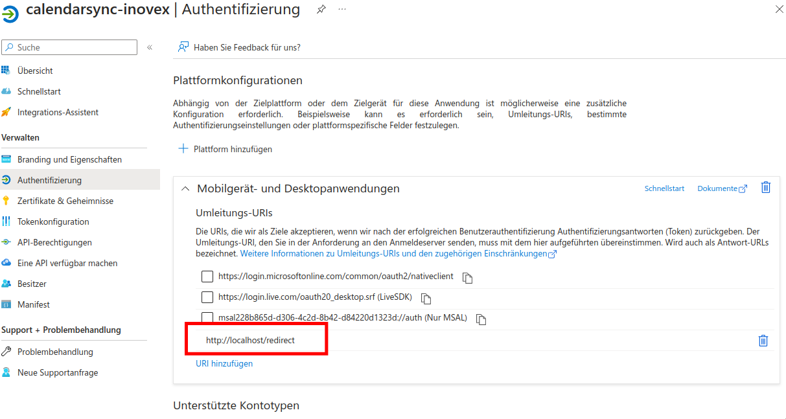
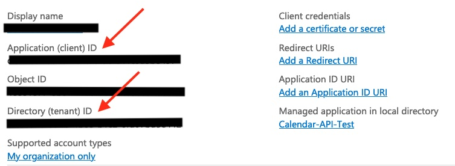
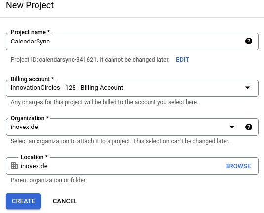
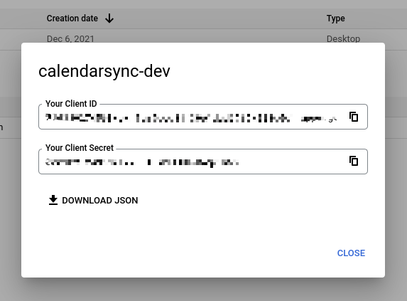

# Adapter Setup

## ZEP Adapter Setup

The ZEP Adapter just the Username and Password as well as the ZEP Endpoint as configuration parameters:

```yaml
source:
  adapter:
    type: "zep"
    calendar: "absences"
    config:
      username: testymctestface@inovex.de
      password: superSuperSecret1337
      endpoint: "https://zep.company.com/zep/sync/dav.php/calendars"
```

The ZEP adapter is only supported as a source.

## Outlook Adapter Setup

The Outlook calendar is synchronized via Microsoft Graph API. You will need to
[register an application on Azure](https://docs.microsoft.com/en-us/azure/active-directory/develop/quickstart-register-app).
The application needs the following permissions:

* `Calendars.ReadWrite`

The `User.Read` permission should be assigned by default. To assign the `Calendars.ReadWrite` permission, click on "API Permissions" and add the delegated permission to the "Microsoft Graph API".

You also need to setup a platform specific configuration. This can be done in the "Authentication" menu. Add a "mobile and desktop application" platform configuration and add `http://localhost/redirect` as a valid redirect uri.



The Outlook adapter can be configured as a source using the tenant-id and client-id of the registered Azure app. Both
tenant-id and client-id can be found in the Azure portal "Overview" tab of the previously registered Azure app. If you want to use the adapter to access personal Microsoft accounts, you need to use the tenant `common`.



```yaml
source:
  adapter:
    type: "outlook_http"
    calendar: "[base64-format string here]"
    oAuth:
      tenantId: "[UUID-format string here]"
      clientId: "[UUID-format string here]"
```

To get your calendar ID, use the [Microsoft Graph Explorer](https://developer.microsoft.com/en-us/graph/graph-explorer) and query `GET https://graph.microsoft.com/v1.0/me/calendar`.

### Shared Mailboxes and delegated calendars

By default, the adapter accesses `/me/calendars/{calendarID}`. To target a Microsoft 365 Shared Mailbox or another delegated user's calendar, set `config.user` to that mailbox's user principal name (UPN) or Entra object ID:

```yaml
source:
  adapter:
    type: "outlook_http"
    calendar: "[shared-calendar-id]"
    config:
      user: "shared-mailbox@example.com"
    oAuth:
      tenantId: "[UUID-format string here]"
      clientId: "[UUID-format string here]"
```

CalendarSync still authenticates an interactive user, not the Shared Mailbox itself. That user must have the appropriate Exchange Online mailbox or calendar delegation for the target mailbox. Microsoft Graph's delegated `Calendars.Read.Shared` permission is sufficient for read-only access. CalendarSync requests `Calendars.ReadWrite.Shared` in addition to `Calendars.ReadWrite` when `config.user` is set because the Outlook adapter can also be used as a sink. The Graph permission does not grant access unless the mailbox delegation is also configured. See Microsoft's documentation for [accessing shared or delegated Outlook calendars](https://learn.microsoft.com/en-us/graph/outlook-get-shared-events-calendars) and [creating events in shared or delegated calendars](https://learn.microsoft.com/en-us/graph/outlook-create-event-in-shared-delegated-calendar). The same `config.user` mechanism can target a delegated normal user mailbox.

Microsoft Graph does not allow delegates to create events with open extensions in Shared Mailbox calendars. CalendarSync therefore stores its synchronization metadata in a single-value legacy extended property whenever `config.user` is set. Existing `/me` configurations continue to use open extensions without changing their stored metadata. See Microsoft's [open-extension limitations](https://learn.microsoft.com/en-us/graph/extensibility-overview#comparison-of-extension-types).

If `config.user` is omitted or empty, the existing `/me` behavior and permissions remain unchanged. When enabling it for an existing configuration, remove the affected CalendarSync authentication entry using the normal auth-storage workflow and authenticate again so the new shared-calendar permission can be granted. Do not edit encrypted authentication storage manually.


## Google Adapter Setup

For the setup of the Google adapter, an OAuth client has to be created. The client configuration is saved to `sync.yaml`
and on the first run, CalendarSync will open a browser window where you can authorize the application to use your calendar.
The setup of the OAuth client is done in the Google Cloud Console. Follow these steps:

+ Open the [Google Cloud Console](https://console.cloud.google.com/home/dashboard) and log in.
+ Now you can either select *New Project* at the top left of the screen or just [click here](https://console.cloud.google.com/projectcreate)
+ Create a new project, name it as you like and select a billing account. But don't worry – the Google Calendar API is free.



+ Now you should be able to select the project in the top left corner. Most likely the project will already be selected now.
+ Either follow the [enable calendar API](https://console.cloud.google.com/flows/enableapi?apiid=calendar-json.googleapis.com) link or follow the steps below.
    + In the search bar, look for `google calendar` and select the **Google Calendar API**
    + You'll be redirected to the API description. Hit the *Enable* button.
+ Once the API is enabled, you'll be redirected again to the API management overview.
+ Before you are allowed to create the client, you will have to configure the *OAuth consent screen*
  + Click on *OAuth consent screen* on the left side (under *APIs & Services*)
  + Enter an app name, e.g. *CalendarSync* and your email address. As the user type, select *Internal*.
+ Click on *Credentials* in the sidebar and then on *Create Credentials*
+ We will need to create an *OAuth client ID*
  + Select *Desktop app* as application type and give it a name of your liking (*calendarsync-dev* maybe?)
+ Once The client ID is created you will see it in the overview.
+ Click on the download icon of the created client
    + You'll see a popup open. Copy the *Client ID* and *Client secret* into your `sync.yaml` as shown below.



```yaml
sink:
  adapter:
    type: google
    calendar: "jerrymccoopface@example.com"
    oAuth:
      clientId: "<clientID>"
      clientKey: "<clientSecret>"
```

If you want to use the created OAuth Application also with accounts outside of your Google Workspace, make sure to set the Usertype to `external` in the `OAuth Consent Screen` Menu.
